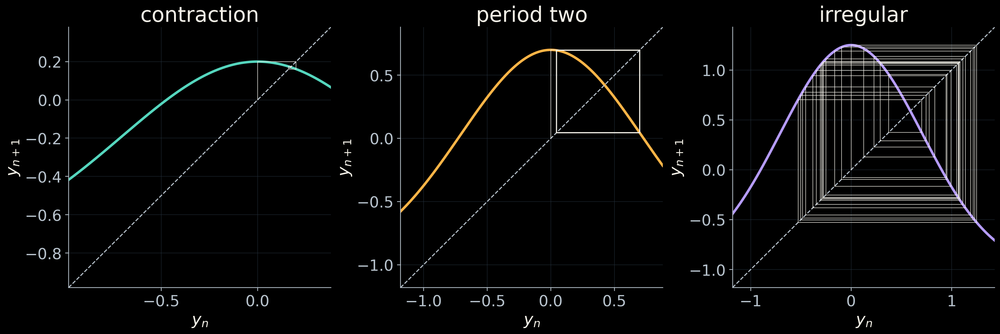

## Gaussian Iterated Map

<p align="center">

</p>


**GaussMap** is a lightweight code for simulating and visualizing the
chaotic dynamics of a generalized Gaussian iterated map.

Designed with clarity and reproducibility in mind, the implementation
provides a simple computational framework for exploring the dynamics
of this nonlinear system.

### Quick Start

Get a local copy of **GaussMap** by cloning the repository:

```bash
git clone https://github.com/americocunhajr/GaussMap.git
cd GaussMap
```

### Features

- Simulation of the generalized Gaussian iterated map
- Visualization of its nonlinear and chaotic dynamics
- Simple and educational implementation
- Fully commented routines
- Suitable for research, teaching, and numerical experimentation

### Research

The **generalized Gaussian iterated map** is a nonlinear discrete-time
dynamical system defined by

$x_{n+1}=f(x_n),
\qquad
f(x)=\gamma e^{-\alpha(x-\delta)^2}+\beta,$

where $\alpha>0$ and $\beta,\gamma,\delta\in\mathbb{R}$.

This four-parameter family generalizes the classical Gaussian map and
provides a simple low-dimensional model with remarkably rich dynamics.
Depending on the parameter values, the system may exhibit fixed points,
periodic orbits, bifurcations, strange attractors, and deterministic chaos.

Gaussian nonlinearities arise naturally in several applications, including
nonlinear filtering, optical systems, neural computation, and localized
amplification mechanisms. The generalized map therefore provides a useful
setting for investigating fundamental phenomena in nonlinear dynamics while
retaining a compact and analytically tractable mathematical form.

**GaussMap** provides a computational implementation of this system,
allowing users to simulate trajectories, vary the model parameters, and
explore its dynamical regimes numerically.

The mathematical formulation and detailed analysis are presented in:

> **A. Cunha Jr**, *The generalized Gaussian iterated map*, 2026.

**Preprint:** [arXiv:XXXX.XXXXX](https://arxiv.org/)

### Documentation

The source code is extensively commented and intended to be easy to
read and modify.

Each routine includes:

- a brief description of its purpose;
- a description of the input parameters;
- a description of the returned quantities.

The code can therefore be used both as a research tool and as an
educational implementation of the generalized Gaussian map.

### Author

**Americo Cunha Jr**

### Citation

If **GaussMap** contributes to your research, please cite:

> **A. Cunha Jr**, *The generalized Gaussian iterated map*, 2026.

```bibtex
@misc{CunhaJr2026Gauss,
  author = {A. {Cunha~Jr}},
  title  = {The generalized {G}aussian iterated map},
  year   = {2026},
  note   = {Preprint},
}
```

### License

**GaussMap** is released under the MIT license. See the LICENSE file for details.

Contributions are welcome and are distributed under the same license.

 

### Institutional support

 &nbsp; &nbsp; 

### Funding


&nbsp;&nbsp;

&nbsp;&nbsp;


## Related publications:
- *M. Tosin, M. V. Issa, D. M. S. Lopes, A. Nascimento, and A. Cunha Jr, Employing 0-1 test for chaos to characterize the chaotic dynamics of a generalized Gauss iterated map, In: XIV Conferência Brasileira de Dinâmica, Controle e Aplicações (DINCON 2019), 2019, https://hal.archives-ouvertes.fr/hal-02388470*
